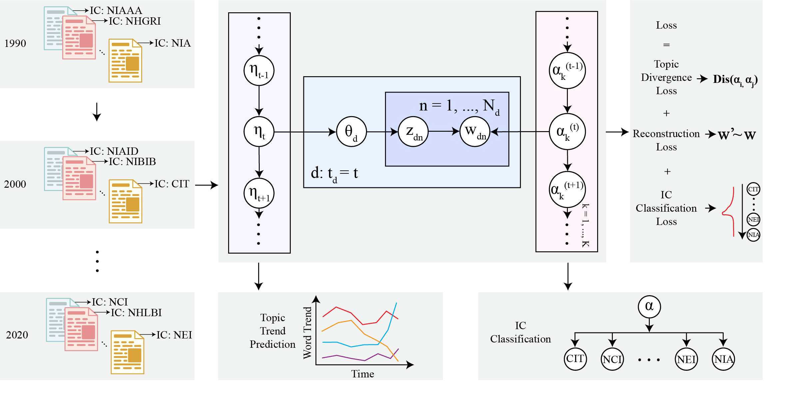

# Turtling
Code repo for paper 'Turtling: A Time-aware Neural Topic Model on NIH Grant Data'

Turtling is a time-aware neural topic model with multi-task losses which encourage diverse topics and IC classification. Turtling extracts topics from biomedical word embedding space and leverages a probabilistic time-series model which allows smooth and coherent topic evolution. We created the Grant dataset which includes 466,730 grant abstract documents and their corresponding ICs across 36 years (1985 to 2020) and tested Turtling on Grant dataset.

<p align='center'>

</p>

# Datasets

The BioWordVec word embeddings can be downloaded with the following link:

https://github.com/ncbi-nlp/BioSentVec

Download the Grant dataset with the following link:

https://drive.google.com/file/d/1AGk8GLMx2bUdzdzMsAdaCUnUjq2ROXEw/view?usp=sharing 


# Example

Move the grant.csv file downloaded in the previous step to scripts/ folder, and run the following command to preprocess the grant dataset.

```
python data_grants.py
```

Run Turtling on the processed Grant dataset by the command below. 

```
sh grants.sh
```

# Contact

For questions about the data and code, please contact ruiyiz5@uci.edu. We will do our best to provide support and address any issues. We appreciate your feedback!

